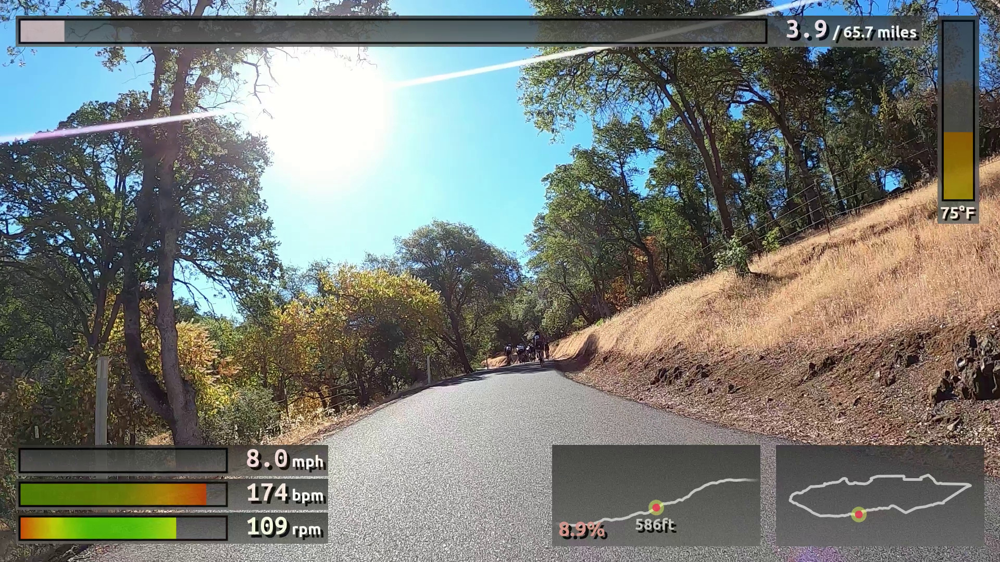

# gpsrenda: simple open-source GPS statistics video overlay renderer

`gpsrenda` is a video overlay renderer that takes statistics from a FIT file, and renders gauges on top of video
captured during the activity using e.g. a GoPro. It uses Cairo to do all its graphics rendering, and `moviepy` as a
video backend. It is designed to be (relatively) simple, hackable, and extensible. It competes with DashWare and Garmin
VIRB (with the hope that it's easier to automate than DashWare, and more turnkey than VIRB).

## Installation

```sh
git clone git@github.com:jwise/gpsrenda.git
cd gpsrenda
pip install .
```

`gpsrenda` should work with system, pyenv/pip, and Anaconda-based Python installations. On Windows only Anaconda has
been tested due to `cairo` being tricky on Windows systems.

## Usage

`renda --help` for full usage information. Point to the example config file at `example_config.yml` for an example that
should look roughly like this:



## Synchronization

One trick you may find helpful is to hit the start button on the GPS *with the GoPro running*, and then use the GPS
start sound in the video to synchronize the time offset between the GPS data and the video. Alternatively, you can use
the `--preview` flag to render a preview with no time offset, and infer the time offset from the overlay. Finally, you
may even find it helpful to use Virb's excellent map-based side-by-side synchronization tool to determine the time
offset before doing your actual overlay here.

You can then use the `-t` flag to provide the time offset to the renderer.

## Hardware

We have tested `gpsrenda` with a GoPro Hero 8 Black + Wahoo ELEMNT BOLT as well as a GoPro Hero 7 Silver + Garmin Edge
530.
